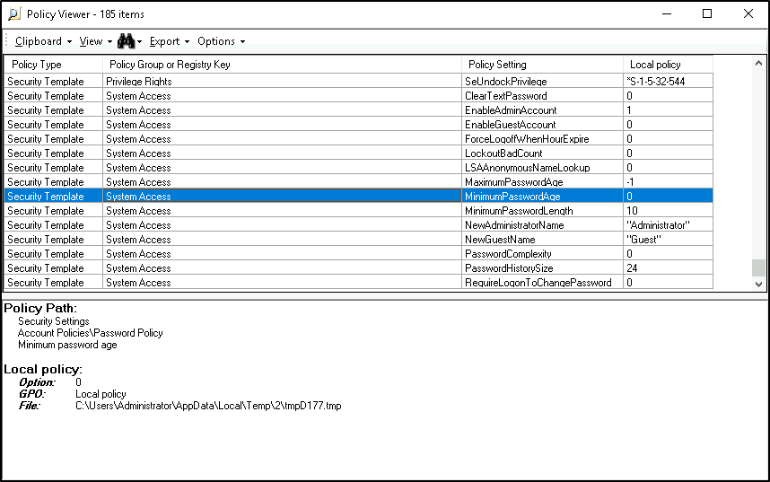

# ☝ WEEK 1 SECTION 1: Hands-On Demonstration

## SECTION 1: Hands-On Demonstration&#x20;

### Part 1. Group Policy&#x20;

&#x20;

1. the updated policy settings for the new PasswordGPO (screen capture):&#x20;

<figure><figcaption></figcaption></figure>

### Part 2. User and Group Administration&#x20;

1. members of the Managers group (screen capture):&#x20;

<figure><figcaption></figcaption></figure>

1. members of the HumanResources group (screen capture):&#x20;

<figure><figcaption></figcaption></figure>

1. members of the ShopFloor group (screen capture):&#x20;

<figure><figcaption></figcaption></figure>

### Part 3. Resource Management&#x20;

1. updated share permissions for the MGRfiles folder (screen capture):&#x20;

<figure><figcaption></figcaption></figure>

1. updated share permissions for the HRfiles folder (screen capture):&#x20;

<figure><figcaption></figcaption></figure>

1. updated share permissions for the SFfiles folder (screen capture):&#x20;

<figure><figcaption></figcaption></figure>

### Part 4. Practical Application

1. access test text file for HRUser01 (screen capture):&#x20;

<figure><figcaption></figcaption></figure>

1. access test text file for SFManager (screen capture):&#x20;

<figure><figcaption></figcaption></figure>

## SECTION 2: Applied Learning&#x20;

### Part 1. User and Group Administration&#x20;

1. the two new users within the Contractors OU (screen capture):&#x20;

### Part 2. Group Policy&#x20;

1. the new Password Policy for the yourname\_PasswordGPO (screen capture):&#x20;
2. the new Account Lockout Policy for the yourname\_PasswordGPO (screen capture):&#x20;

### Part 3. Resource Management&#x20;

1. the contents of the CoreFiles directory (screen capture):&#x20;
2. the updated Security permissions for the yourtown directory (screen capture):&#x20;

### Part 4. Practical Application&#x20;

1. the result of Part 4, Step 3 (screen capture):&#x20;
2. description of the results of Part 4 for the ANewuser account;&#x20;
3. explanation of the results of Part 4 for the ANewuser account;&#x20;

## SECTION 3: Lab Challenge and Analysis&#x20;

### Analysis and Discussion&#x20;

1. Use the Internet to research the SYSTEM account. Why is it necessary to include this account with full control on a directory?&#x20;

### Tools and Commands&#x20;

1. Using the icacls utility, document the command that will give the ANewuser account write access to the your school folder.  &#x20;

## Challenge Exercise&#x20;

1. Using your work in this lab as a guide, create a three-level directory structure for your family tree (grandparents, parents, children). You will need to create user accounts for each member of the family (at least 2 in each generation), create groups for each generation, and then secure the folders so that only members of a single generation can write to files within that generation’s directory. Make screen captures to document your progress and describe your process.&#x20;
