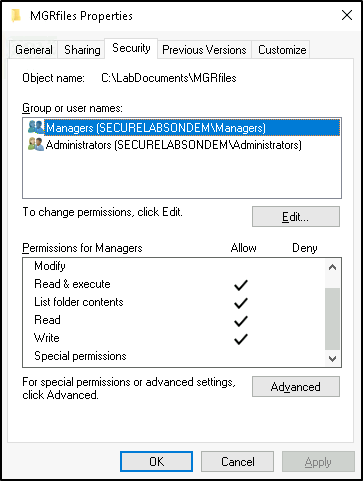

# 👾 Configuring BitLocker and Windows Encryption

## SECTION 1:

1. Lab Report file including screen captures of the following;&#x20;
   *   encrypted Documents folder;&#x20;

       <figure><figcaption></figcaption></figure>
   *   Notepad and the error message;&#x20;

       <figure><figcaption></figcaption></figure>
   *   settings on the Confirmation page;&#x20;

       <figure><figcaption></figcaption></figure>
   *   Notepad and the BitLocker recovery key;&#x20;

       <figure><figcaption></figcaption></figure>
   *   This PC folder with the unlocked drive;&#x20;

       <figure><figcaption></figcaption></figure>

## SECTION 2:

1. Lab Report file including screen captures of the following:
   *   encrypted Documents folder;

       &#x20;

       <figure><figcaption></figcaption></figure>
   *   Notepad and the error message;&#x20;

       <figure><figcaption></figcaption></figure>
   *   unlocked E: drive in the File Explorer;&#x20;

       <figure><figcaption></figcaption></figure>
   *   user access details for the Encrypt folder;

       <figure><figcaption></figcaption></figure>
